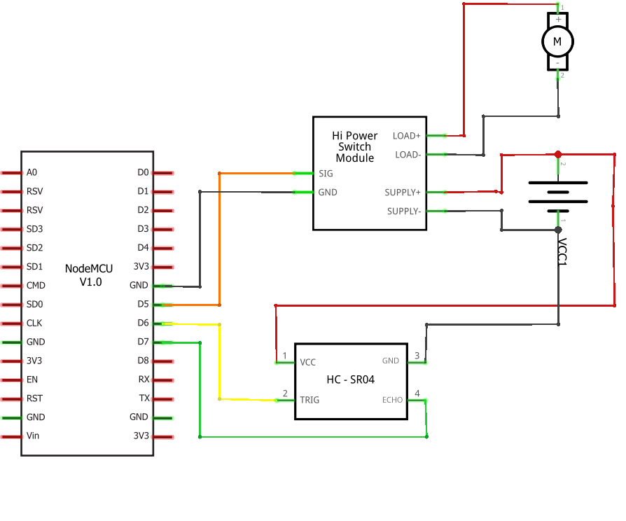
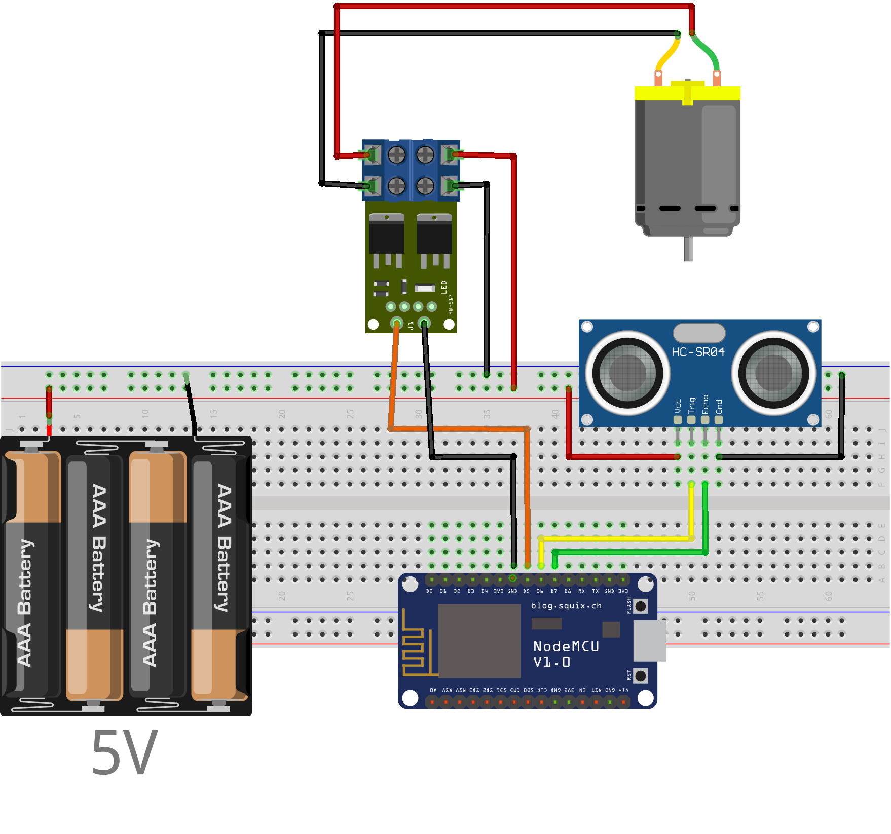

# Bancada Didática inclusiva para o auxílio no aprendizado do Controle

Repositório referente ao projeto multidisciplinar do 8 período de computação do CEFET-MG campus V.

## Organização do protótipo
No diretório "/arduino" estão os códigos referentes a bancada no NodeMCU.
Bibliotecas externas utilizadas:
* ESP8266WiFi.h -> Disponível em: <a href="https://github.com/esp8266/Arduino/tree/master/libraries/ESP8266WiFi">https://github.com/esp8266/Arduino/tree/master/libraries/ESP8266WiFi</a>
* Thread.h -> Disponíve em: <a href = "https://github.com/ivanseidel/ArduinoThread">https://github.com/ivanseidel/ArduinoThread</a>
* WebSocketsServer.h -> Disponível em: <a href="https://github.com/Links2004/arduinoWebSockets">https://github.com/Links2004/arduinoWebSockets</a>

obs: Dentro do diretório "/arduino" exite um arquivo chamado "config.hpp" nele estão definidas todas as constantes do projeto, como pinagem e informações da rede.

No diretório "/ui_project" contém a interface gráfica feita em flutter.
Bibliotecas externas utilizadas: 
* Web Socket channel -> Disponível em: <a href="https://pub.dev/packages/web_socket_channel">https://pub.dev/packages/web_socket_channel</a>
* Charts flutter -> Disponível em: <a href="https://pub.dev/documentation/charts_flutter/latest/">https://pub.dev/documentation/charts_flutter/latest/</a>
* Just The Tooltip -> Disponível em: <a href="https://pub.dev/packages/just_the_tooltip">https://pub.dev/packages/just_the_tooltip</a>
## Diagramas do projeto

